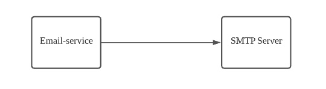
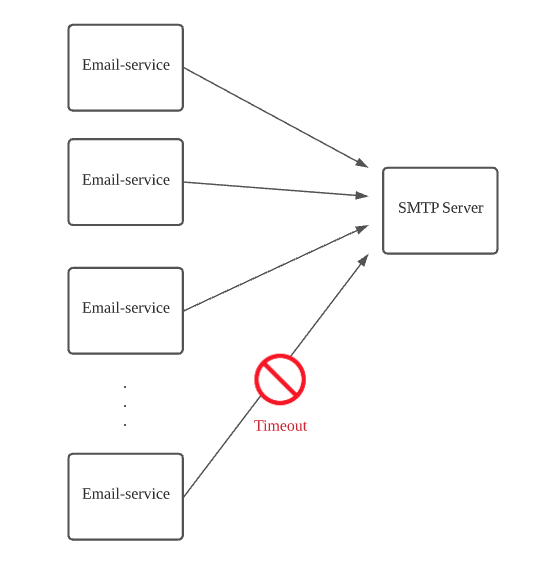
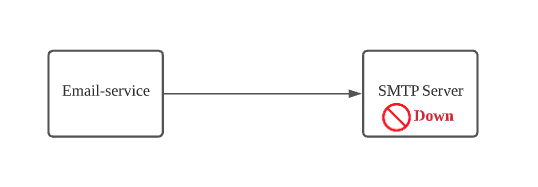
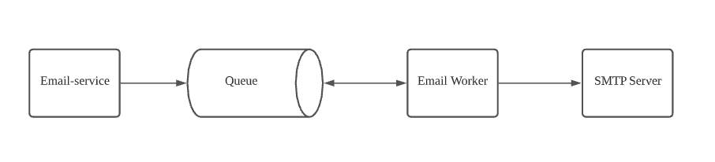
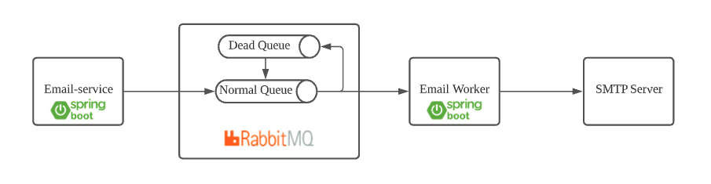

# sending-email-with-queue

A simple, reliable and resilient architecture for sending emails with Queue-Based Load leveling pattern.

## Context and problem

A web app needs to send out the emails via an SMTP Server.


There are 2 issues:

- **Un-scalable**: If a large number of instances of the web app run concurrently, the data store might be unable to
  respond to requests quickly enough, causing requests to time out, be throttled, or otherwise fail.
  
- **Not resilient**: If the SMTP Server was down, the web app cannot send out the emails. It does not have the ability
  to re-send the emails when the SMTP Server recovered and up again, so we will lose the emails in the downtime period
  of SMTP Server.
  

## Solution

Refactor the solution and introduce a queue and a worker (a service which works as a subscriber to the queue) between
the web app and the SMTP Server.


- The web app (**email-service**) posts a message containing the data required for sending email to a queue.
- The **queue** acts as a buffer, storing the message until it's retrieved by the worker.
  - We don't want data will not be lost if the worker was temporary down, so we config queue as durable queue for
    guaranteed message delivery.
- The worker (**email-worker**) retrieves the messages from the queue and processes them by calling SMTP Server for
  sending out the email.
  - If worker processes the message successfully (the email was sent successfully), the worker sends acknowledgement (
    ack) to the queue, then the queue will delete that message.
  - If worker dies (or SMTP Server was timeout...) without sending an ack, the queue will understand that a message
    wasn't processed fully and will re-queue it. We could configure the maximum number of re-queue times.
  - If the message exceeds the maximum of re-queue times, it will be sent to dead queue.

This solution provides the following benefits:

- It can help to **maximize availability** because delays arising in email-worker or SMTP Server won't have an immediate
  and direct impact on the web app (email-service), which can continue to post messages to the queue even when the
  worker isn't available or isn't currently processing messages.
- It can help to **maximize scalability** because both the number of queues and the number of workers can be varied to
  meet demand.
- It can help to **improve the resilience** because now the system have the ability to recover and send out the email
  after SMTP Server failure and back to normal.
  - In the case connection to SMTP Server is intermittent (server down in the very short period, connection timeout),
    the worker could easily retry.
  - In the case the SMTP Server is down for a long time, the user could move the message from the dead queue to the
    normal queue, then the worker could process as normal.

## Sample implementation


Those above components are provided in this repository as following:

- **Email-Service** is built with Spring Boot, it exposes the API endpoint for sending out the email. When the user
  called this API, it will send the message to RabbitMQ.
- **Email-Worker** is built with Spring Boot, it subscribes to the RabbitMQ to get the message, extract the info from
  the message to create the email to send to SMTP Server.
- Queue: we use [RabbitMQ](https://www.rabbitmq.com/) as Docker container. There is a cloud service of RabbitMQ
  is [CloudAMQP](https://www.cloudamqp.com/) (there is free plan for development also). You're free to choose the
  message broker that meet your need.
- SMTP Server: we use [fake SMTP Server](https://github.com/gessnerfl/fake-smtp-server) as Docker container.

Note: **RabbitMQ** and **SMTP Server** are provided as _docker-compose_ in this repository. Both RabbitMQ and fake SMTP
Server have the Web Management UI so that you could easily see what happened in RabbitMQ and SMTP Server.

## Setup development workspace

The setup development workspace process is simpler than ever with following steps:

1. Install [JDK 11](https://www.oracle.com/java/technologies/javase-jdk11-downloads.html).
1. Install [Docker for Desktop](https://www.docker.com/products/docker-desktop).
1. Install [Maven](https://maven.apache.org/download.cgi?Preferred=ftp://mirror.reverse.net/pub/apache/).
1. Clone this project to your local machine.
1. Open terminal and make sure you're at the root directory of this project, run the command ```docker-compose up``` (
   this will automatically setup RabbitMQ and a fake SMTP Server for you).

That's all.

## Application default configuration and endpoints

- Email-service:
  - Default port: 8081
  - API Endpoint for sending out email: http://localhost:8081/emails (POST)
  - Swagger UI: http://localhost:8081/swagger-ui/index.html

- Email-worker:
  - Default port: 8082

- RabbitMQ:
  - Web Management UI: http://localhost:15672/ (login with **guest**:**guest**)

- Fake SMTP Server:
  - Web Management UI: http://localhost:5080/

## References
- [Cloud design patterns](https://docs.microsoft.com/en-us/azure/architecture/patterns/) - *Azure Architecture Center |
  Microsoft Docs*

  
